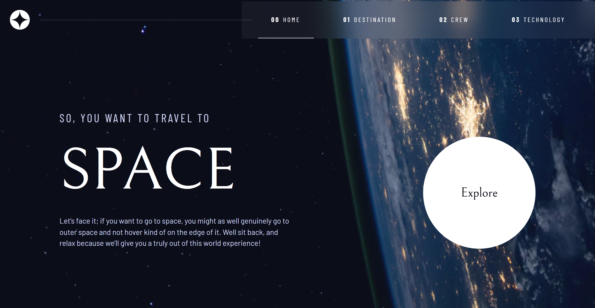
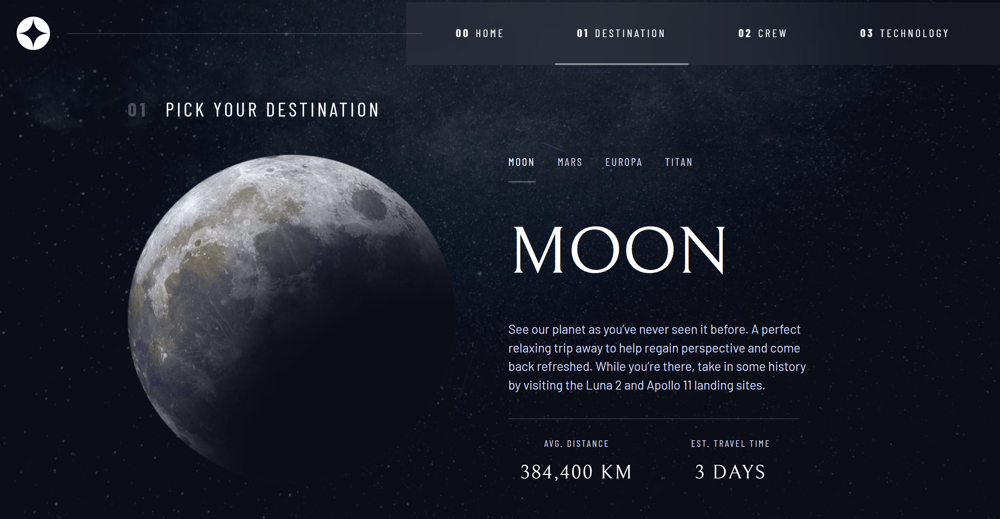
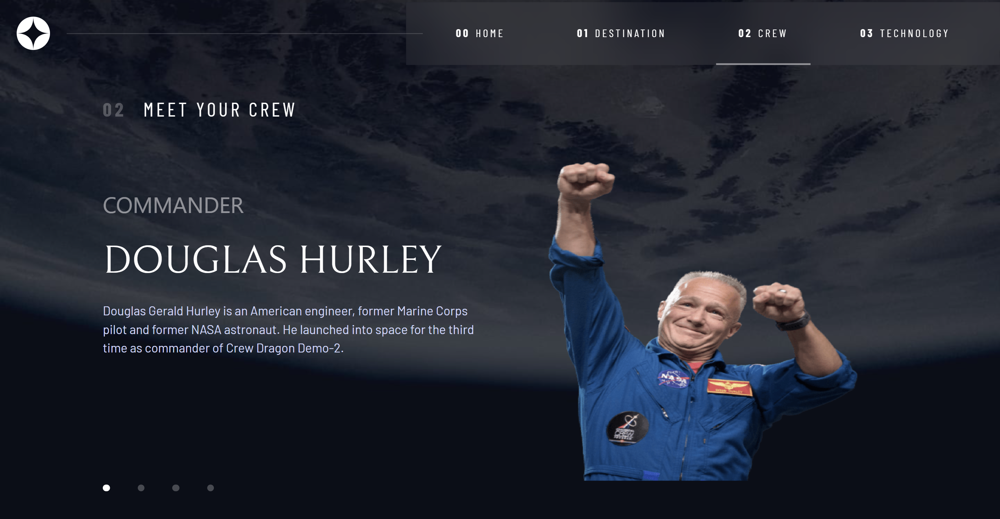
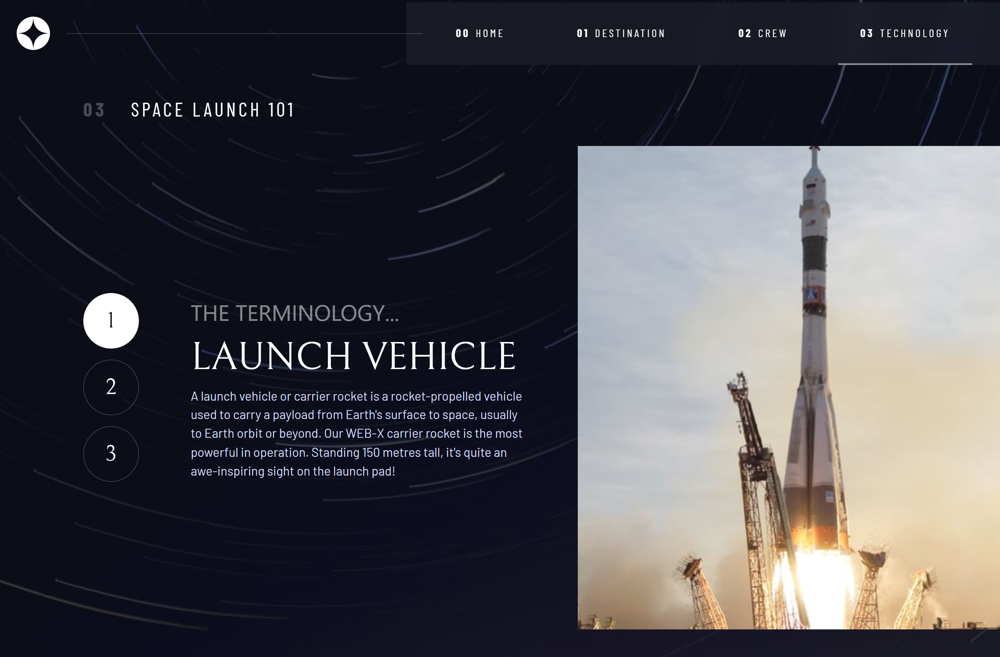

# Space Tourism Website

A fully interactive front-end project built with React and Tailwind CSS. This project demonstrates modular component architecture, dynamic state management, and responsive design, developed as part of my 100-day coding journey.

## 🚀 Technologies Used

- **React.js**: Modular component-based architecture.
- **Tailwind CSS**: Responsive, utility-first styling.
- **React Router**: Seamless client-side navigation.
- **Custom Hooks**: Abstracted logic for reusable state management.

## ✨ Key Features

- **Clean Code Architecture**: Separated business logic from UI using `useSelection` custom hooks.
- **Reusable Components**: Built a robust `SelectionList` and `ContentSection` to minimize code repetition.
- **Responsive Design**: Mobile-first approach, ensuring a seamless experience across all devices.
- **Dynamic Content**: State-driven UI updates for Crew, Destination, and Technology sections.

## 📸 Project Screenshots

### Home Page

### Destination Page

### Crew Page

### Technology Page

## 🛠️ Project Structure

- `/components/shared`: Reusable components (buttons, headers, lists).
- `/hooks`: Custom logic extraction (`useSelection.js`).
- `/myData.js`: Centralized data management.

## 💡 Lessons Learned

- Implementing the DRY (Don't Repeat Yourself) principle through component abstraction.
- Mastering React `useState` and `props` for dynamic interactions.
- Structuring CSS with Tailwind to maintain a clean, maintainable codebase.

## 👤 About the Developer

**Beshoy Essam (OriginB)**
A Chemical Engineer transitioning into Front-End Web Development. Dedicated to building clean, scalable, and efficient web solutions.

- Started my journey: March 2nd, 2026.
- Passion: Decoding the secrets of high-performance coding.

---

_Built with passion as part of my 100-day coding challenge._
